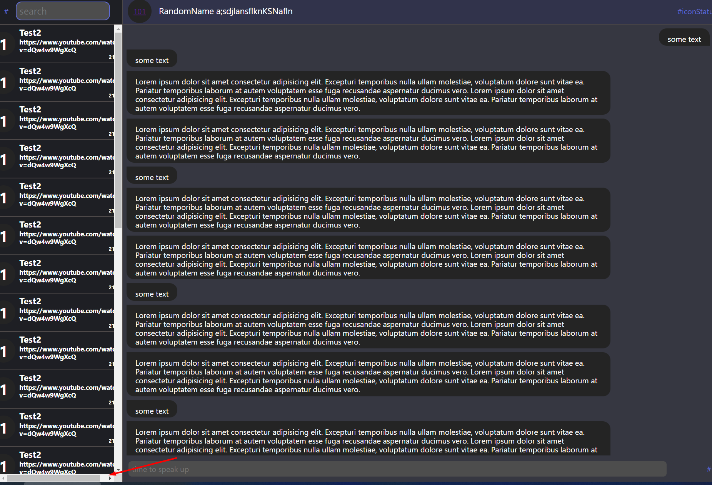
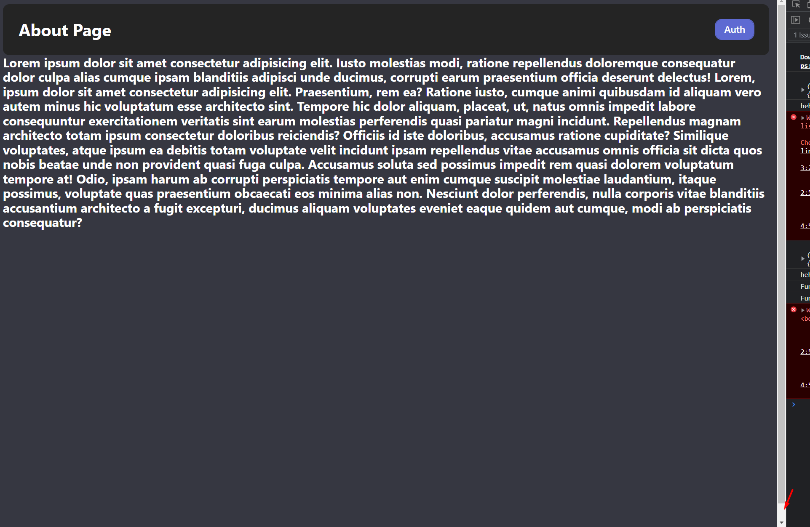
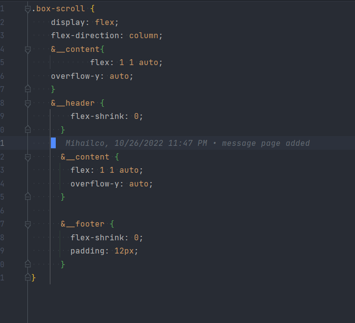

1.  Горизонтального скрола быть не должно
2.  Не должно быть вертикального скрола. Скрол появляется только в случае когда контент не
   влезает по вертикали
3. БЭМ используется через раз и не всегд правильно
4. Форматирование кода в некоторых файлах хромает, погугли хоткеи для своей IDE на автоформатирование. Вот например, как
   не должно быт
   
5. Старайся создать класс и переиспользовать его. Например, 
6. не оставляй пустые классы, ненужные коментарии и прочий мусор в файлах, от него нет толку
